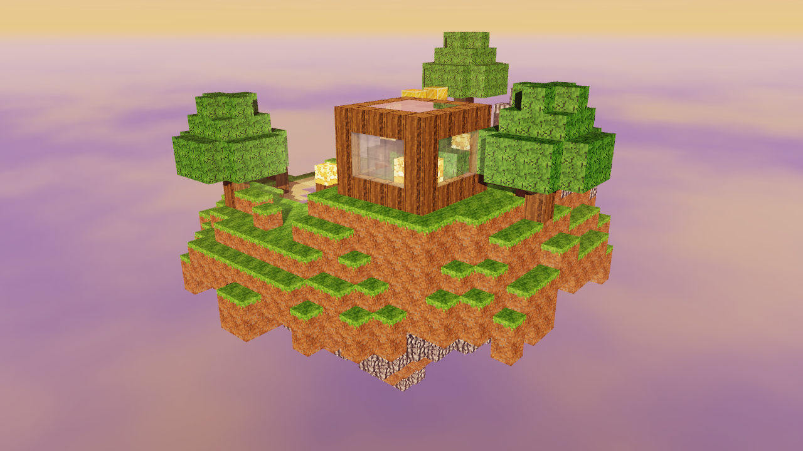
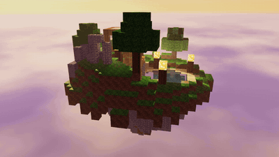
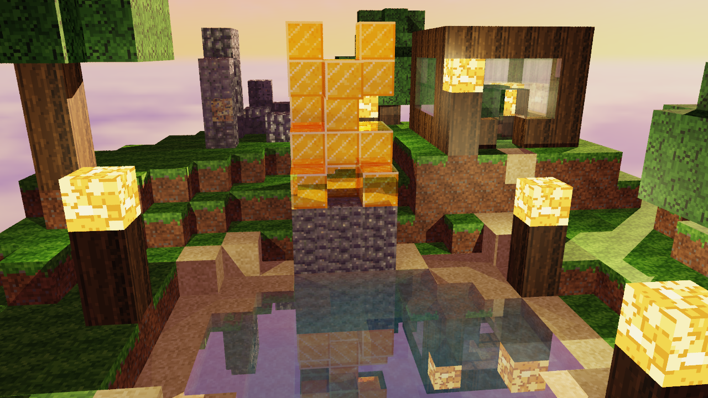
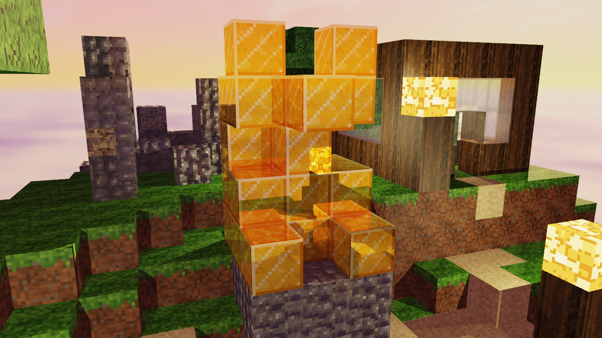
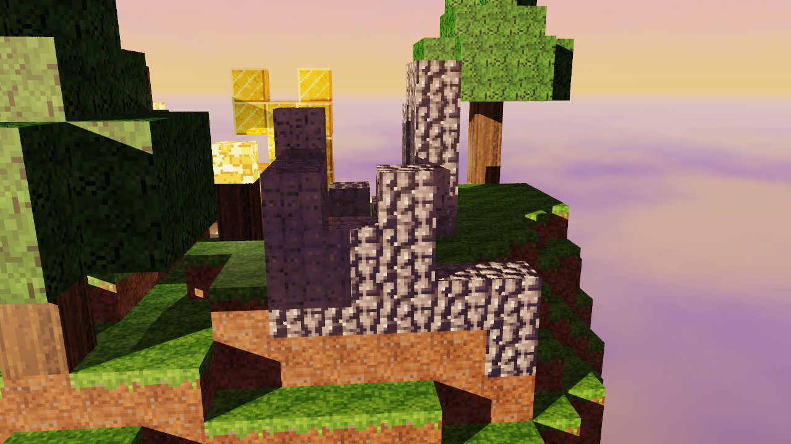
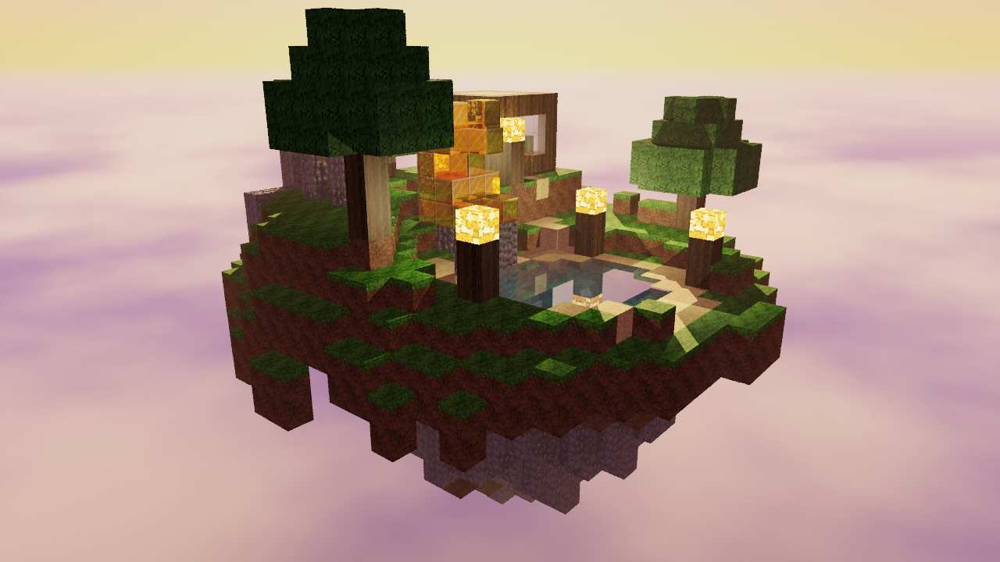
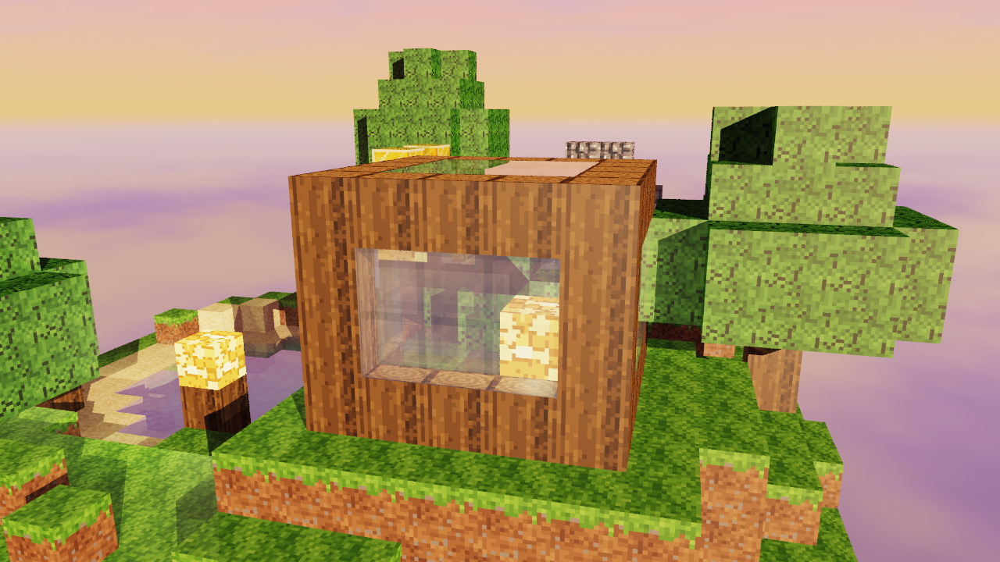

# Isla flotante al atardecer: diorama con raytracing en Rust

Raytracer por CPU escrito desde cero en Rust, **sin ninguna dependencia externa**: solo la biblioteca estándar. Renderiza un diorama de cubos texturizados al estilo Minecraft: una isla procedural que flota sobre un mar de nubes al atardecer. En la isla hay un lago, un invernadero de vidrio, la estatua de oro de un gato sentado junto al agua, ruinas de piedra, faroles de glowstone y árboles. La parte inferior de la isla cuelga como un cono de roca y tierra.

El programa escribe cada frame como BMP (con un escritor propio) y el video se arma después con `ffmpeg`.



## Video

<!-- VIDEO AQUÍ -->
> **Para el autor:** sube el video y reemplaza este bloque por una de estas opciones:
>
> - **Archivo en GitHub:** edita este README en github.com y arrastra `diorama.mp4` a esta sección. GitHub sube el archivo y genera un enlace `https://github.com/user-attachments/...` que se reproduce aquí mismo.
> - **YouTube:** `[](https://www.youtube.com/watch?v=ID_DEL_VIDEO)`
>
> El video se genera con `cargo run --release -- --preset final` seguido de `scripts/make_video.sh` (ver abajo).

Vista previa en baja resolución (GIF generado a partir de los frames):



## Capturas

| | |
|---|---|
|  |  |
| *Lado iluminado por el sol: invernadero, árboles y la parte inferior colgando.* | *El lago refracta el fondo de arena y refleja la estatua de oro y el cielo.* |
|  |  |
| *La estatua de oro refleja el agua, el cielo y la isla.* | *Ruinas de piedra con normal map bajo luz rasante del sol.* |
|  |  |
| *A contraluz: neblina y faroles de glowstone encendidos.* | *Invernadero de vidrio con el glowstone y la planta adentro.* |

## Rúbrica: dónde se ve cada punto

El video dura 12 s (288 frames a 24 fps): **0:00–0:08**, órbita completa de 360°; **0:08–0:12**, zoom que se acerca a la estatua y al lago (punto más cercano en **0:10**) y se aleja sin dejar de rotar.

| Pts | Criterio | Implementación | Dónde se ve en el video |
|---:|---|---|---|
| 20 | Complejidad de la escena | Isla procedural de 24×24, lago, invernadero, estatua de gato, ruinas con arco, 5 faroles, 3 árboles, camino de arena y parte inferior colgando (`scene.rs`, `terrain/`) | Todo el video; la órbita (0:00–0:08) recorre todos los lados |
| 15 | Atractivo visual | Cielo de atardecer con nubes y mar de nubes, tone mapping ACES, gamma 2.2, antialiasing estratificado (4 spp), neblina suave, agua turquesa (Beer–Lambert) | Todo el video |
| 10 | Paralelismo y optimización | Bloques de 16×16 con `std::thread::scope` + `AtomicUsize`; DDA de Amanatides & Woo; [benchmarks](#benchmarks) | ~0.63 s por frame a 1280×720 y 4 spp con 8 hilos (6× más rápido que con 1 hilo) |
| 10 | Rotación y zoom | Cámara orbital (`camera.rs`) animada en `animation.rs` | Rotación 360°: 0:00–0:08. Zoom de acercamiento y alejamiento: 0:08–0:12 |
| 25 | 7 materiales | Grama, piedra, madera, agua, vidrio, oro y glowstone (+ arena y hojas), cada uno con textura y parámetros propios (`material.rs`) | Todos visibles en 0:00–0:02 y en el zoom 0:09–0:11 (arena y hojas en todo el video) |
| 10 | Refracción | Agua (IOR 1.33) y vidrio (IOR 1.5) con Snell, reflexión interna total y Fresnel de Schlick | Lago: 0:00–0:02 y 0:09–0:11 (se ve el fondo de arena). Vidrio del invernadero: 0:02–0:05 |
| 5 | Reflexión | Oro (reflectividad 0.7) teñido de dorado; el agua también refleja | Estatua: 0:00–0:02 y 0:09–0:11 (refleja agua, cielo e isla); reflejos en el lago en esos mismos tramos |
| 10 | Normal maps | Piedra de las ruinas y del pedestal, con normal map por Sobel desde un mapa de altura | Ruinas: 0:05–0:08 (lado oeste, con luz rasante). Pedestal: 0:09–0:11 |
| 10 | Material emisivo | Glowstone en 5 faroles y dentro del invernadero; cada bloque es una luz puntual | Faroles en todo el video, más notorios a contraluz (0:00–0:02) y en el zoom (0:09–0:11); glowstone dentro del invernadero: 0:02–0:05 |
| 10 | Skybox | Cubemap de 6 caras generado por código (exportable/reemplazable) | Fondo de todo el video; también en los reflejos del oro y del agua |
| 20 | Terreno procedural (≥16×16) | 24×24 columnas con fBm de Perlin propio + máscara radial; semilla fija (`--seed`) | Todo el video |

## Cómo compilar y ejecutar

Se necesita Rust (edición 2021). `Cargo.toml` no tiene dependencias.

```bash
# Un frame de prueba rápido (640x360, 1 spp) → out/still.bmp y out/still.ppm
cargo run --release -- --preset preview --still

# Los 288 frames finales (1280x720, 4 spp) → out/frames/frame_0000.bmp …
cargo run --release -- --preset final

# Arma diorama.mp4 con ffmpeg
scripts/make_video.sh
```

### Opciones

| Opción | Uso |
|---|---|
| `--preset preview\|final` | preview = 640×360, 1 spp, profundidad 3. final = 1280×720, 4 spp, profundidad 4 |
| `--width` / `--height` / `--spp` / `--depth` | Sobrescriben el preset |
| `--still` | Renderiza un solo frame en `out/still.bmp` (y `out/still.ppm`) |
| `--frames N` | Número de frames de la animación (288 por defecto) |
| `--start K` | Reanuda la animación desde el frame K |
| `--seed S` | Semilla del terreno (2024 por defecto) |
| `--threads N` | Número de hilos (por defecto, todos los disponibles) |
| `--yaw` / `--pitch` / `--dist` | Cámara manual en grados/unidades (modo still) |
| `--focus island\|statue\|greenhouse\|ruins\|lake` | Objetivo de la cámara en modo still |
| `--bench` | Imprime las tablas de benchmarks de abajo |

Ejemplos:

```bash
cargo run --release -- --still --focus statue --yaw 70 --pitch 15 --dist 12
cargo run --release -- --still --seed 7            # otra isla
cargo run --release -- --preset final --start 150  # reanudar un render interrumpido
```

## Benchmarks

Medidos con `cargo run --release -- --bench` (y `--preset final --bench`) en un Intel Core i5-1135G7 (4 núcleos / 8 hilos, laptop), con Linux. Cada valor es el mejor de 3 corridas, en la vista por defecto de la isla completa. "Mrayos/s" cuenta rayos primarios, secundarios y de sombra.

#### Hilos (640x360, 1 spp, profundidad 3)

| Hilos | ms/frame | Mrayos/s | Aceleración |
|---:|---:|---:|---:|
| 1 | 254.5 | 1.38 | 1.00× |
| 2 | 124.2 | 2.82 | 2.05× |
| 4 | 60.5 | 5.79 | 4.21× |
| 8 | 43.1 | 8.12 | 5.90× |

#### Hilos (1280x720, 4 spp, profundidad 4)

| Hilos | ms/frame | Mrayos/s | Aceleración |
|---:|---:|---:|---:|
| 1 | 3813.5 | 1.50 | 1.00× |
| 2 | 1872.0 | 3.05 | 2.04× |
| 4 | 907.7 | 6.28 | 4.20× |
| 8 | 634.5 | 8.99 | 6.01× |

El escalado es casi lineal hasta 4 hilos, que es el número de núcleos físicos. De 4 a 8 hilos, el hyperthreading aporta otro ~40 %. El render final completo (288 frames a 1280×720 y 4 spp) tardó **264 s** (~0.9 s por frame, incluida la escritura del BMP).

#### DDA vs fuerza bruta (320x180 rayos primarios, 334 cubos, 1 hilo)

| Método | ms | Hits | Aceleración |
|---|---:|---:|---:|
| Fuerza bruta (todos los cubos) | 523.9 | 15878 | 1.00× |
| DDA (Amanatides & Woo) | 6.3 | 15878 | 83.2× |

La comparación usa la escena de demostración pequeña (`Scene::demo`, un grid de 12×8×12 con 334 cubos). La fuerza bruta prueba cada rayo contra la AABB de cada cubo, mientras que el DDA solo visita las celdas que el rayo atraviesa. Ambos encuentran exactamente los mismos hits (también lo verifica un test con rayos aleatorios). En la isla completa, con ~2 600 cubos, la diferencia sería todavía mayor.

## Arquitectura

```
src/
  main.rs            CLI a mano (std::env::args), presets y orquestación
  math/              Vec3, Ray, Mat3, smoothstep
  color.rs           tone mapping ACES, gamma 2.2, conversión a u8
  camera.rs          cámara orbital (yaw, pitch, distancia con clamp) y rayos
  image_io/          lectura/escritura BMP 24 bits y escritura PPM P6
  texture.rs         texturas lineales, muestreo nearest con wrap
  texture_gen.rs     texturas procedurales 16x16 y normal map por Sobel
  material.rs        tabla de materiales
  skybox.rs          cubemap: dirección → (cara, u, v); cielo de atardecer
  world/             VoxelGrid, AABB (slabs) y recorrido DDA
  terrain/           xorshift64*, Perlin + fBm y generador de la isla
  scene.rs           construye la isla, las estructuras y las luces
  lighting.rs        sol, luces puntuales y rayos de sombra
  shading.rs         Blinn-Phong, reflect, refract, Fresnel, marco tangente
  renderer.rs        trace(ray, depth) → color; buffer de ids de material
  parallel.rs        render multihilo por bloques
  animation.rs       trayectoria de la cámara por frame
tests/               terrain_tests, scene_tests, render_tests
```

El flujo de un frame: `animation` da la cámara → `parallel` reparte bloques de 16×16 entre hilos → por cada muestra, `renderer::Tracer::trace` recorre el grid con el DDA, sombrea la superficie con `lighting`/`shading` y lanza recursivamente los rayos de reflexión y refracción → el color HDR pasa por ACES y gamma → los bloques se copian al framebuffer y se guarda el BMP.

## Técnicas

**DDA de Amanatides & Woo.** El mundo es un grid denso de 32×28×32 vóxeles. El rayo primero se recorta contra la caja del grid (método de slabs) y luego avanza celda por celda: en cada paso cruza el plano más cercano entre los tres ejes, así que visita solo las celdas que atraviesa y no prueba los ~2 600 cubos de la isla. La normal de la cara sale del eje cruzado. Solo hay superficie donde cambia el material entre una celda y la siguiente: por eso no hay caras internas entre dos bloques de agua y, al salir del agua o del vidrio hacia el aire, se genera la interfaz de salida con la normal invertida. Los rayos de sombra usan el mismo recorrido como "any hit": un bloque opaco corta la luz y cada material transparente la atenúa según su `transparency`.

**Refracción y Fresnel.** En cada interfaz se conocen los materiales de ambos lados, así que la razón de IOR `n1/n2` es correcta al entrar (aire→agua, 1/1.33) y al salir (vidrio→aire, 1.5/1). La dirección refractada sigue la ley de Snell y, si `sin²θt > 1`, hay reflexión interna total. El reparto entre reflexión y transmisión usa la aproximación de Schlick, `F = R0 + (1-R0)(1-cosθ)^5`, con el ángulo transmitido cuando el rayo sale al medio menos denso. La mezcla final `local·kl + reflejo·kr + refracción·kt`, con `kr = reflectividad + transparencia·F` y `kt = transparencia·(1-F)`, conserva la energía (`kl + kr + kt = 1`). La recursión se corta en la profundidad máxima o cuando la contribución al píxel baja de 0.01.

**Normal mapping.** El mapa de altura de la piedra (adoquines de Voronoi) se convierte en normales con el filtro Sobel 3×3 con wrap: `n = normalize(-gx·s, gy·s, 1)`. Cada cara del cubo tiene un marco tangente fijo (T, B, N) consistente con sus coordenadas UV, y la normal del mapa se lleva a espacio de mundo con esa matriz. Con el sol bajo del atardecer, la luz rasante resalta el relieve de las ruinas y del pedestal.

**Terreno con fBm.** El ruido Perlin 2D está implementado a mano, con una tabla de permutación barajada por un xorshift64* propio, así que la misma semilla da siempre la misma isla. La altura es `base + amp·fbm(x, z)` con 4 octavas (lacunaridad 2, ganancia 0.5), atenuada por la máscara radial `1 - smoothstep(r0, r1, d)`. La distancia `d` se perturba con ruido para que la silueta no sea circular. Un cuenco al centro-este forma el lago, con una orilla que baja suavemente hasta el nivel del agua para contenerla. Debajo, la isla se afila en un cono irregular de piedra con bolsas de tierra.

**Paralelismo.** La imagen se divide en bloques de 16×16. Se lanzan `available_parallelism()` hilos dentro de `std::thread::scope` y un `AtomicUsize` les reparte los bloques (balanceo dinámico). Cada hilo escribe en un buffer local de bloque y lleva su propio contador de rayos: no hay `Mutex` ni asignaciones por píxel en el loop caliente. La escena es inmutable y se comparte por referencia. El jitter del antialiasing sale de un hash de `(x, y, muestra, frame)`, por lo que la imagen es idéntica byte a byte con cualquier número de hilos (hay un test que lo comprueba).

**Iluminación.** Sol direccional bajo y cálido `(1.0, 0.62, 0.38)` con sombras; luz ambiental igual a 0.35 × el color promedio del skybox; y cada bloque de glowstone como luz puntual con atenuación `1/(1 + k·d²)`, de la que cada punto usa solo las 4 más cercanas. Los reflejos del oro y su brillo especular se tiñen con su color, y el agua absorbe la luz con Beer–Lambert.

## Reemplazar texturas y skybox

Al ejecutar el programa por primera vez, las texturas y el cielo generados se exportan como BMP de 24 bits:

- `assets/textures/*.bmp`: `grass_top`, `grass_side`, `dirt`, `stone`, `stone_height`, `stone_normal`, `wood_side`, `wood_top`, `water`, `glass`, `gold`, `glowstone`, `sand` y `leaves` (16×16, aunque se acepta cualquier tamaño).
- `assets/skybox/{px,nx,py,ny,pz,nz}.bmp`: las 6 caras del cubemap con la convención de OpenGL (`px` = +X). En las caras laterales, la fila de arriba es el cielo.

**Si un BMP existe, se carga en lugar de generarse.** Para usar texturas propias, sobrescribe el archivo (BMP sin compresión de 24 o 32 bits) y vuelve a ejecutar. Para regenerar las originales, borra el archivo. Si reemplazas `stone_height.bmp` y borras `stone_normal.bmp`, el normal map se recalcula desde tu mapa de altura. Ninguna textura proviene de Minecraft ni de terceros: todas se generan por código.

## Tests

```bash
cargo test            # unitarios + integración
cargo test --release
cargo clippy --all-targets -- -D warnings
```

Los tests unitarios cubren vectores, matrices, AABB, DDA (vóxel correcto, normales en ±X/±Y/±Z, sin paradas entre celdas de agua, salida del grid y equivalencia con la fuerza bruta), sombreado (simetría de la reflexión, Snell, reflexión interna total, Fresnel), normal maps, texturas, BMP/PPM (con padding de filas), RNG, ruido, skybox, cámara, color, animación y CLI. Los de integración comprueban el terreno (≥16×16, alturas, lago, determinismo), la escena (7 materiales, ≥4 luces, estatua junto al agua) y el render (los 7 materiales visibles para los rayos primarios desde 3 momentos de la animación, skybox visible, determinismo con 1 y 4 hilos y ausencia de NaN).
